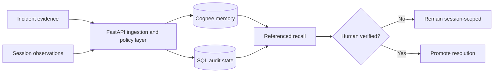

# RecallOps

**Evidence-backed incident memory for engineering teams.**

[Live product](https://rachitr-recallops.hf.space/app?demo=cloudflare) ·
[Hugging Face Space](https://huggingface.co/spaces/rachitr/recallops) ·
[Architecture](docs/architecture.md)

RecallOps turns incident timelines, deployment records, runbooks, logs, and
postmortems into a governed operational memory. Responders can recover how a
previous failure was diagnosed, inspect the evidence behind every answer, and
promote only human-verified resolutions for future incidents.

## The problem

Operational knowledge is usually fragmented across tools and documents. During
an incident, teams repeatedly reconstruct the same context:

- What changed before the failure?
- Has this symptom appeared before?
- Which mitigation worked, and why?
- Is the current runbook still trustworthy?

Search can locate documents. It does not preserve incident context, causal
relationships, provenance, or the lifecycle of corrected knowledge.

## The product

RecallOps provides a single workflow for building reliable incident memory:

1. **Observe** — capture timestamped incident facts in temporary session memory.
2. **Recall** — retrieve related incidents and operational guidance with source
   references.
3. **Investigate** — inspect the evidence graph, causal path, and retrieval
   trace behind each result.
4. **Resolve** — promote a resolution only after explicit human confirmation.

Permanent evidence and temporary incident observations remain distinct
throughout the workflow. Obsolete guidance can be removed without discarding
the surrounding incident history.

## Why Cognee

[Cognee](https://www.cognee.ai/) provides the memory layer used to organize and
retrieve operational knowledge:

- `remember` stores durable evidence and session-scoped observations.
- `recall` returns context with evidence references.
- `improve` promotes verified incident learning.
- `forget` removes obsolete memory items.

RecallOps adds the operational controls around that memory layer: provenance,
stable evidence identity, human approval gates, audit records, protected usage
limits, and explicit degraded states.

## Architecture



The application ships as a single Docker container:

- React 19 and TypeScript frontend
- FastAPI application and API
- Cognee Cloud memory adapter
- SQLAlchemy and Alembic audit state
- SQLite for the public deployment
- React Three Fiber and React Flow visualizations

See [docs/architecture.md](docs/architecture.md) for the full data flow and
[docs/cognee-lifecycle.md](docs/cognee-lifecycle.md) for memory lifecycle
semantics.

## Run locally

Requirements:

- Python 3.13
- [uv](https://docs.astral.sh/uv/)
- Node.js 22 and npm 10+

```powershell
uv sync --frozen --group dev
npm ci --prefix frontend
npm --prefix frontend run build
uv run alembic -c backend/alembic.ini upgrade head
uv run uvicorn recallops.main:app --app-dir backend/src --port 7860
```

Open [http://127.0.0.1:7860/app](http://127.0.0.1:7860/app).

Docker is also supported:

```powershell
docker compose up --build
```

## Configuration

Copy `.env.example` to `.env`. Keep credentials in local or platform secret
storage; never commit them.

| Variable | Purpose |
| --- | --- |
| `APP_ENV` | Runtime environment |
| `APP_DATABASE_URL` | Async SQLAlchemy database URL |
| `APP_PUBLIC_ORIGIN` | Allowed browser origin |
| `APP_COGNEE_MODE` | `fake` for offline development or `live` for Cognee Cloud |
| `APP_COGNEE_DATASET` | Permanent evidence dataset |
| `COGNEE_BASE_URL` | Cognee Cloud API base URL |
| `COGNEE_API_KEY` | Cognee Cloud API key |

The browser never receives Cognee credentials.

## Quality and security

```powershell
uv run ruff check backend scripts
uv run mypy
uv run pytest -m "not integration"
npm --prefix frontend run lint
npm --prefix frontend run test
npm --prefix frontend run build
uv run python scripts/preflight.py
```

RecallOps includes strict request validation, credential redaction, origin
controls, URL-ingestion safeguards, fail-closed memory states, and a repository
preflight that rejects committed secrets.

## Public case study

The live product demonstrates RecallOps with an attributed reconstruction of
Cloudflare's December 5, 2025 outage and its relationship to the November 18,
2025 outage.

Sources:

- [Cloudflare outage on December 5, 2025](https://blog.cloudflare.com/5-december-2025-outage/)
- [Cloudflare outage on November 18, 2025](https://blog.cloudflare.com/18-november-2025-outage/)
- [Code Orange: Fail Small](https://blog.cloudflare.com/fail-small-resilience-plan-uk-ua/)

The included timeline and event records are derived from those public sources.
They are not private Cloudflare logs or internal runbooks. RecallOps is not
affiliated with or endorsed by Cloudflare.
