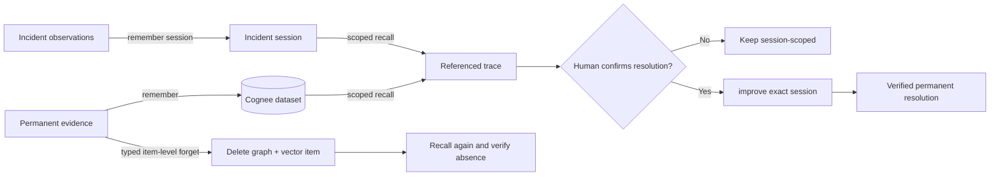

# RecallOps

RecallOps is an auditable incident-memory console that retrieves the reasoning
behind prior fixes, exposes the exact evidence behind each answer, forgets
obsolete evidence with retrieval proof, and promotes only human-verified
resolutions.

## Problem and impact

Incident responders repeatedly rediscover the same dependency failures because
timelines, runbooks, deploy records, and postmortems remain disconnected.
Ordinary search can find documents, but it does not preserve session context,
causal relationships, evidence provenance, or the lifecycle of a corrected
memory. RecallOps turns those artifacts into a controlled operational memory.

The deterministic case study reconstructs Cloudflare's December 5, 2025 outage
from official public postmortems, relates it to the November 18 outage, removes
an explicitly labelled RecallOps-created unsafe assumption, and recalls a
human-verified resolution from a clean incident session.

## Why Cognee is essential

Cognee is the memory system, not a decorative model call:

- `remember` stores permanent evidence and incident-session observations.
- `recall` retrieves graph-backed answers with document/chunk references.
- `improve` promotes one human-confirmed incident session into reusable memory.
- `forget` removes one obsolete evidence data ID from graph/vector memory.

RecallOps adds the policy layer Cognee intentionally does not supply: protected
credit reserve, stable local identity, provenance persistence, confirmation
gates, safe failure states, and before/after deletion verification.

## Memory lifecycle



The detailed operation contract is in
[docs/cognee-lifecycle.md](docs/cognee-lifecycle.md).

## Architecture

RecallOps ships as one container:

- React 19 + TypeScript operational UI.
- FastAPI API and SPA fallback.
- SQLAlchemy/Alembic local audit and lifecycle state.
- An SDK-independent memory port with deterministic fake and Cognee Cloud
  adapters.
- SQLite for the free demo; Cognee remains the graph/vector memory provider in
  live mode.

See [docs/architecture.md](docs/architecture.md) for trust boundaries and data
flow.

## Attributed public case study

The incident facts are derived from Cloudflare's public material. The compact
event log and change record are derived artifacts, not raw internal records.
The unsafe killswitch instruction is an explicit RecallOps-created anti-pattern
used only to demonstrate item-level forgetting. Stable UUIDv5 evidence IDs and
`CF-OUTAGE-2025-12-05` reset semantics keep the flow repeatable.

1. Open `/app?demo=cloudflare`.
2. Select **Load Cloudflare outage case study**.
3. Recall the relationship to the November 18 outage.
4. Inspect the graph source, retrieval type, document, chunk, and causal path.
5. Forget `unsafe-global-killswitch-assumption.md` with the exact phrase.
6. Confirm the real resolution and wait for `promoted`.
7. Open the proof report and run **Prove in clean session**.

Official sources:

- [Cloudflare outage on December 5, 2025](https://blog.cloudflare.com/5-december-2025-outage/)
- [Cloudflare outage on November 18, 2025](https://blog.cloudflare.com/18-november-2025-outage/)
- [Code Orange: Fail Small](https://blog.cloudflare.com/fail-small-resilience-plan-uk-ua/)

RecallOps is not affiliated with or endorsed by Cloudflare.

## Local setup

Requirements: Python 3.13, uv 0.11.25+, Node 22+, and npm 10+.

```powershell
uv sync --frozen --group dev
Set-Location frontend
npm ci
npm run build
Set-Location ..
$env:APP_DEMO_BOOTSTRAP = "true"
uv run alembic -c backend/alembic.ini upgrade head
uv run uvicorn recallops.main:app --app-dir backend/src --port 7860
```

Open `http://127.0.0.1:7860/app`.

For the complete container fallback:

```powershell
docker compose up --build
```

## Environment variables

Copy `.env.example` to an untracked `.env`; add values locally or in server-side
secret storage. Never commit values.

| Variable | Purpose |
|---|---|
| `APP_ENV` | `local`, `test`, or `production` |
| `APP_DATABASE_URL` | Async SQLAlchemy URL |
| `APP_PUBLIC_ORIGIN` | Sole allowed browser origin |
| `APP_DEMO_MODE` | Enables the attributed case-study reset flow |
| `APP_DEMO_BOOTSTRAP` | Seeds missing fixture evidence at startup |
| `APP_DEMO_ADMIN_TOKEN` | Server-side seed authorization |
| `APP_COGNEE_MODE` | `fake` for offline tests or `live` |
| `APP_COGNEE_DATASET` | Fixed `recallops_evidence_v1` dataset |
| `APP_COGNEE_TOKEN_SUPPLY` | Hard token supply used by the guard |
| `APP_COGNEE_PROTECTED_RESERVE` | Fail-closed reserve |
| `APP_ALLOW_URL_INGESTION` | Enables validated local HTTPS ingestion |
| `COGNEE_BASE_URL` | Cognee Cloud endpoint, server-side only |
| `COGNEE_API_KEY` | Cognee Cloud key, server-side only |
| `RUN_COGNEE_INTEGRATION` | Explicit live-test opt-in |

## Test commands

```powershell
uv run ruff check backend scripts
uv run mypy
uv run pytest -m "not integration"
npm --prefix frontend run lint
npm --prefix frontend run test
npm --prefix frontend run build
npm --prefix frontend run e2e
uv run python scripts/preflight.py
```

Offline tests never require Cognee credentials. Live tests require both the
opt-in flag and an operator credit-dashboard check.

## Deployment

The Docker image runs as UID `10001`, listens on `${PORT:-7860}`, migrates the
database before startup, serves the built SPA through FastAPI, and exposes
`/api/health`.

For a free Hugging Face Docker Space:

1. Keep hardware at `cpu-basic`; do not enable paid persistent storage.
2. Push this repository to a Docker Space.
3. Add only `COGNEE_BASE_URL`, `COGNEE_API_KEY`, and
   `APP_DEMO_ADMIN_TOKEN` as server-side Space secrets.
4. Set `APP_COGNEE_MODE=fake`, `APP_DEMO_MODE=true`, and
   `APP_DEMO_BOOTSTRAP=true` as non-secret variables.
5. Confirm `/api/health`, then rehearse the deployed judge flow once.

The verified public deployment is:

- Source: <https://github.com/Rachit-2216/recallops>
- App: <https://rachitr-recallops.hf.space>
- Space repository: <https://huggingface.co/spaces/rachitr/recallops>
- Runtime: free `cpu-basic`, Docker SDK, port `7860`
- Memory mode: deterministic fake adapter

The compose fallback and public Space use fake memory so judging is free and
deterministic. Switch to live mode only after the configured Cognee Cloud
endpoint returns reference-bearing graph recall results for the gated adapter
contract.

## Known limitations

- The public demo covers one documented outage family and is not a general
  incident corpus.
- Session observations do not have an account-wide delete primitive; rejecting a
  hypothesis is a local/session lifecycle action.
- HTTPS URL ingestion rejects redirects and private/reserved destinations; it is
  disabled in public demo mode.
- Live Cognee mutation tests are deliberately gated and should run only once
  after validating configuration and the protected credit reserve.
- The configured Cognee Cloud account authenticates, accepts file ingestion,
  and returns chunk search results. Its graph-completion recall did not include
  the document references required by the RecallOps evidence contract during
  the controlled proof, so live mode currently fails closed and the public
  deployment intentionally uses the deterministic adapter.
- Free ephemeral hosting can recreate local SQLite state on cold start; stable
  fixture identity keeps the fake fallback deterministic.

## Disclosures

Source use: incident facts come from the three linked Cloudflare publications.
All derived files identify their source and status. RecallOps does not claim
access to Cloudflare's private logs, configuration, or runbooks.

AI assistance: the repository was developed with AI-assisted implementation and
review. Product decisions, lifecycle constraints, tests, and final verification
remain explicitly documented and reproducible.
