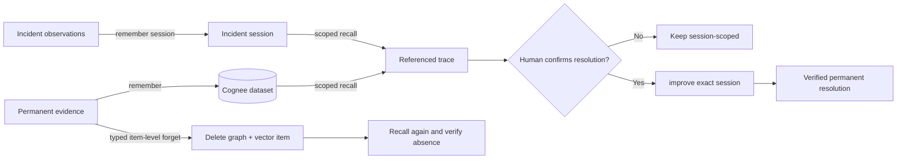

# RecallOps

RecallOps is an auditable incident-memory console that retrieves the reasoning
behind prior fixes, exposes the exact evidence behind each answer, forgets
obsolete evidence with retrieval proof, and promotes only human-verified
resolutions.

## Problem and impact

Incident responders repeatedly rediscover the same dependency failures because
timelines, runbooks, deploy records, and postmortems remain disconnected.
Ordinary search can find documents, but it does not preserve session context,
causal relationships, evidence provenance, or the lifecycle of a corrected
memory. RecallOps turns those artifacts into a controlled operational memory.

The deterministic checkout scenario demonstrates a current SEV1 after
`deploy-418`, its similarity to `INC-1842`, an obsolete Redis cache instruction,
and a verified resolution that can be recalled from a clean incident session.

## Why Cognee is essential

Cognee is the memory system, not a decorative model call:

- `remember` stores permanent evidence and incident-session observations.
- `recall` retrieves graph-backed answers with document/chunk references.
- `improve` promotes one human-confirmed incident session into reusable memory.
- `forget` removes one obsolete evidence data ID from graph/vector memory.

RecallOps adds the policy layer Cognee intentionally does not supply: protected
credit reserve, stable local identity, provenance persistence, confirmation
gates, safe failure states, and before/after deletion verification.

## Memory lifecycle



The detailed operation contract is in
[docs/cognee-lifecycle.md](docs/cognee-lifecycle.md).

## Architecture

RecallOps ships as one container:

- React 19 + TypeScript operational UI.
- FastAPI API and SPA fallback.
- SQLAlchemy/Alembic local audit and lifecycle state.
- An SDK-independent memory port with deterministic fake and Cognee Cloud
  adapters.
- SQLite for the free demo; Cognee remains the graph/vector memory provider in
  live mode.

See [docs/architecture.md](docs/architecture.md) for trust boundaries and data
flow.

## Deterministic demo

All fixtures are synthetic. Stable UUIDv5 evidence IDs and `INC-2048` reset
semantics make the judge flow repeatable.

1. Open `/app?demo=checkout`.
2. Select **Load Checkout Outage Demo**.
3. Recall the relationship to the previous Redis incident.
4. Inspect the graph source, retrieval type, document, chunk, and causal path.
5. Forget `stale-cache-reset-rule.md` with the exact confirmation phrase.
6. Confirm the real resolution and wait for `promoted`.
7. Open the proof report and run **Prove in clean session**.

The full narration is in [demo/demo-script.md](demo/demo-script.md).

## Local setup

Requirements: Python 3.13, uv 0.11.25+, Node 22+, and npm 10+.

```powershell
uv sync --frozen --group dev
Set-Location frontend
npm ci
npm run build
Set-Location ..
$env:APP_DEMO_BOOTSTRAP = "true"
uv run alembic -c backend/alembic.ini upgrade head
uv run uvicorn recallops.main:app --app-dir backend/src --port 7860
```

Open `http://127.0.0.1:7860/app`.

For the complete container fallback:

```powershell
docker compose up --build
```

## Environment variables

Copy `.env.example` to an untracked `.env`; add values locally or in server-side
secret storage. Never commit values.

| Variable | Purpose |
|---|---|
| `APP_ENV` | `local`, `test`, or `production` |
| `APP_DATABASE_URL` | Async SQLAlchemy URL |
| `APP_PUBLIC_ORIGIN` | Sole allowed browser origin |
| `APP_DEMO_MODE` | Enables the synthetic reset flow |
| `APP_DEMO_BOOTSTRAP` | Seeds missing fixture evidence at startup |
| `APP_DEMO_ADMIN_TOKEN` | Server-side seed authorization |
| `APP_COGNEE_MODE` | `fake` for offline tests or `live` |
| `APP_COGNEE_DATASET` | Fixed `recallops_evidence_v1` dataset |
| `APP_COGNEE_TOKEN_SUPPLY` | Hard token supply used by the guard |
| `APP_COGNEE_PROTECTED_RESERVE` | Fail-closed reserve |
| `APP_ALLOW_URL_INGESTION` | Enables validated local HTTPS ingestion |
| `COGNEE_BASE_URL` | Cognee Cloud endpoint, server-side only |
| `COGNEE_API_KEY` | Cognee Cloud key, server-side only |
| `RUN_COGNEE_INTEGRATION` | Explicit live-test opt-in |

## Test commands

```powershell
uv run ruff check backend scripts
uv run mypy
uv run pytest -m "not integration"
npm --prefix frontend run lint
npm --prefix frontend run test
npm --prefix frontend run build
npm --prefix frontend run e2e
uv run python scripts/preflight.py
```

Offline tests never require Cognee credentials. Live tests require both the
opt-in flag and an operator credit-dashboard check.

## Deployment

The Docker image runs as UID `10001`, listens on `${PORT:-7860}`, migrates the
database before startup, serves the built SPA through FastAPI, and exposes
`/api/health`.

For a free Hugging Face Docker Space:

1. Keep hardware at `cpu-basic`; do not enable paid persistent storage.
2. Push this repository to a Docker Space.
3. Add only `COGNEE_BASE_URL`, `COGNEE_API_KEY`, and
   `APP_DEMO_ADMIN_TOKEN` as server-side Space secrets.
4. Set `APP_COGNEE_MODE=live`, `APP_DEMO_MODE=true`, and
   `APP_DEMO_BOOTSTRAP=true` as non-secret variables.
5. Confirm `/api/health`, then rehearse the deployed judge flow once.

The compose fallback defaults to fake memory so it is free and deterministic.

## Screenshots

The submission captures should show:

- demo home and protected reserve;
- `INC-2048` cockpit with referenced recall;
- Memory Inspector provenance/path tabs;
- verified forget before/after proof;
- promoted resolution and clean-session proof.

No credential-bearing browser or dashboard content belongs in screenshots.

## 90-second video

Record the deployed URL using [demo/demo-script.md](demo/demo-script.md). The
submission checklist intentionally requires the final video URL to be added only
after the deployed rehearsal passes.

## Known limitations

- The public demo uses one synthetic incident narrative.
- Session observations do not have an account-wide delete primitive; rejecting a
  hypothesis is a local/session lifecycle action.
- HTTPS URL ingestion rejects redirects and private/reserved destinations; it is
  disabled in public demo mode.
- Live Cognee mutation tests are deliberately gated and should run only once
  after validating configuration and the protected credit reserve.
- Free ephemeral hosting can recreate local SQLite state on cold start; stable
  fixture identity keeps the fake fallback deterministic.

## Disclosures

Synthetic data: every incident, service event, deploy, log, runbook, and
postmortem in the demo is fictional and purpose-built.

AI assistance: the repository was developed with AI-assisted implementation and
review. Product decisions, lifecycle constraints, tests, and final verification
remain explicitly documented and reproducible.
