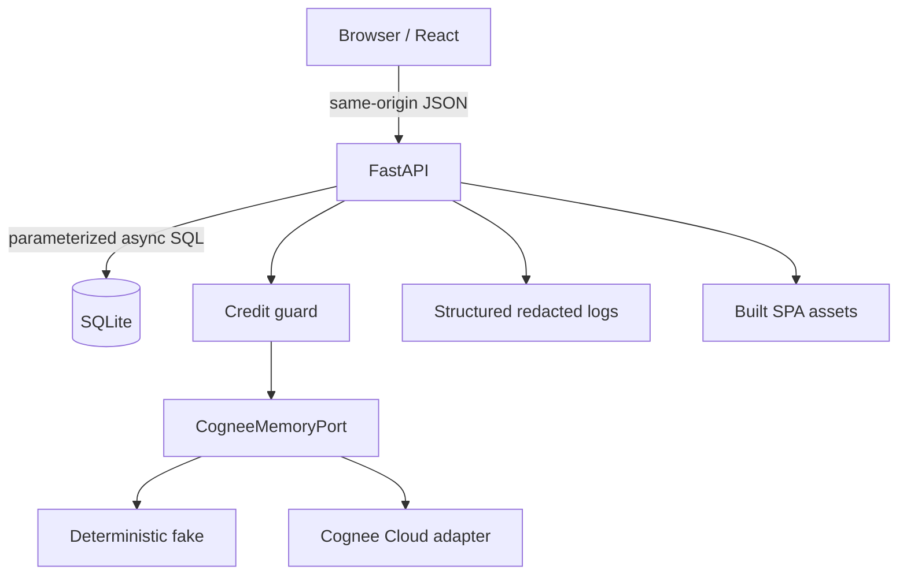

# RecallOps architecture

## Runtime

The browser never receives provider credentials. FastAPI owns validation,
request IDs, safe error mapping, rate limits, lifecycle gates, and security
headers. SQL stores operational/audit state; Cognee stores permanent and
session memory.

## Boundaries

| Boundary | Controls |
|---|---|
| Browser → API | strict CORS, CSP, runtime response schemas, request limits |
| Upload/URL → evidence | MIME + suffix + size validation, HTTPS-only SSRF checks |
| API → Cognee | isolated adapter, typed contract, credit guard, safe errors |
| Session → permanent | referenced trace + human confirmation + improve success |
| Forget request → provider | exact phrase, item data ID, before/after recall |
| Logs | allowlisted metadata and recursive secret redaction |

## Data ownership

- `EvidenceItem` owns stable evidence identity and lifecycle state.
- `Incident` owns a server-generated session ID.
- `Observation` is session-scoped and can remain pending without a permanence
  claim.
- `RecallTrace` persists source, search type, answer, and exact references.
- `Resolution` stores human-confirmed facts and promotion state.
- `AuditOperation` records remember/recall/improve/forget outcomes and safe
  categories.

## Failure model

Memory outages do not block local incident recording. Partial indexing yields a
202 state, provider failures yield a retryable safe envelope, missing references
remain unverified, improve failure stays `promotion_failed`, and forget failure
keeps evidence visible.
